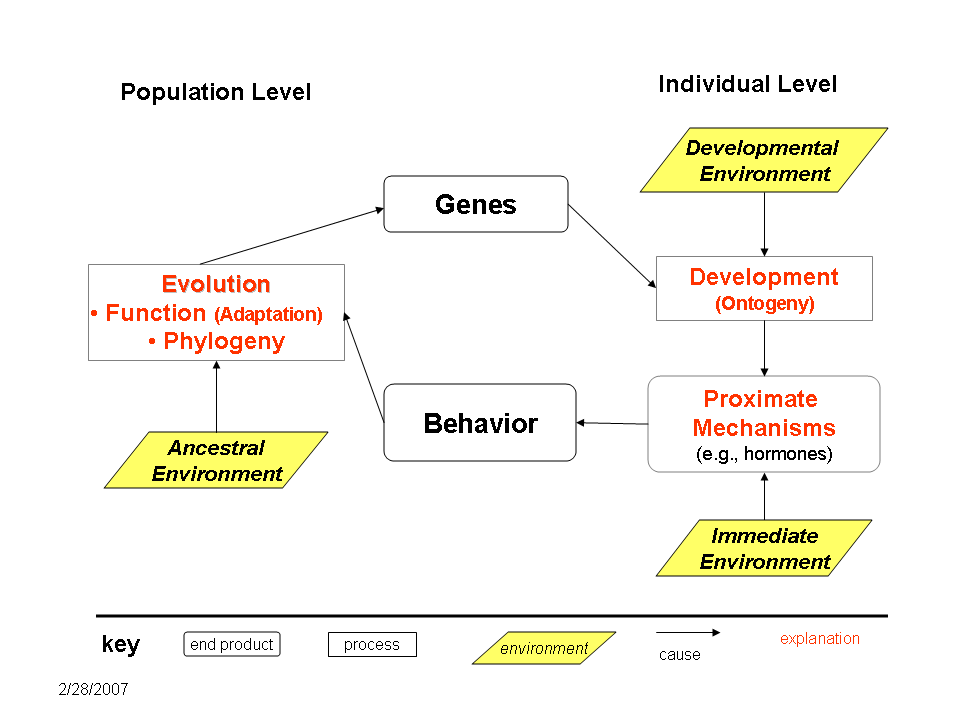

## Who am I?

- Rick Gilmore, Associate Professor of Psychology
- Ph.D. from Carnegie Mellon, CNBC
- Development of perception and action; open science, data sharing
- <http://gilmore-lab.github.com>, <http://databrary.org>

## 2015-01-12 -- Brain architectures for adaptive behavior

1. What behaviors are essential for animals to perform?
2. How is the nervous system organized to contribute to these behaviors?
3. Should molecular neurobiologists think about ethology? Should cognitive neuroscientists think about molecular neurobiology? Why or why not?

## 2015-01-14 -- Divide and conquer: Functional segregation in sensory processing

1. How can functional properties of neurons in the cerebral cortex be studied?
2. What are the properties of sensory-related neurons in the cerebral cortex?
3. Are there similarities across sensory systems?

## 2015-01-19 -- Maps in the cortex

1. What is the evidence for a topographic organization in sensory and motor processing?
2. Are maps fundamental to sensory processing or merely a byproduct of other factors?

## 2015-01-21 -- Studying human brain function through fMRI

1. How does fMRI work? What does it measure?
2. How do "functional" maps of the cerebral cortex derived from fMRI relate to maps derived from other methods?
3. How are fMRI-based maps actually created?

## Brain architectures for adaptive behavior

**Swanson, L. W. (2007). Quest for the basic plan of nervous system circuitry. Brain Research Reviews, 55(2), 356–372. http://doi.org/10.1016/j.brainresrev.2006.12.006**

Tinbergen, N. (1963). On aims and methods of ethology. Zeitschrift Für Tierpsychologie, 20, 410–433.

## Supplemental sources

Swanson, L. W. (n.d.) Brain Architecture. Retrieved 2015-12-25 from
<http://larrywswanson.com/?page_id=1523>

Tinbergen's four questions (n.d.). Retrieved 2015-12-25 from <https://en.wikipedia.org/wiki/Tinbergen%27s_four_questions>

## What behaviors are essential for animals to perform?

## What behaviors are essential for animals to perform?

- Ingestion
- Defense
- Reproduction

## What behaviors are essential for animals to perform

- Locomotion, posture control
- Object manipulation
- Vocalization/signaling

## What questions about these behaviors should we ask?

|           | Static     | Dynamic   |
|-----------|------------|-----------|
| Proximate | Mechanism  | Ontogeny  |
| Ultimate  | Adaptation | Phylogeny |

## What questions about these behaviors should we ask? {.smaller}

## How is the nervous system organized to contribute to these behaviors?

## Cajal

## Swanson/Cajal Four Systems

## Predicted [connectome](http://www.humanconnectomeproject.org)

## Are these frameworks useful to you?

- Why or why not?

## Should molecular neurobiologists think about ethology?

- Why or why not?

## Should cognitive neuroscientists think about molecular neurobiology? 

- Why or why not?