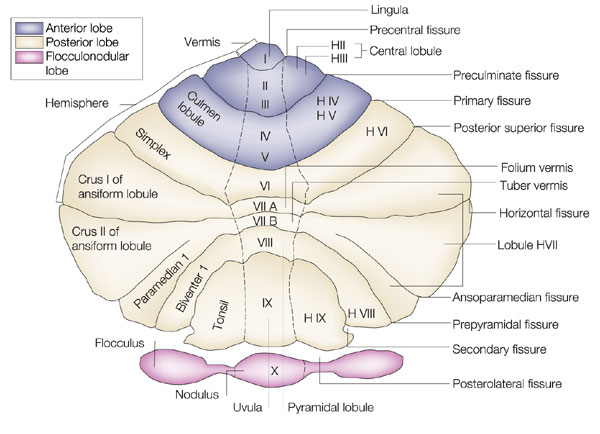
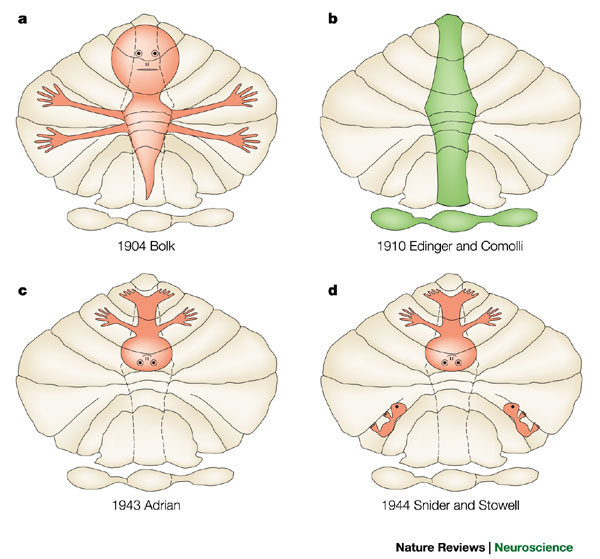
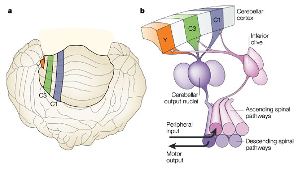

## 2015-01-19 -- Maps in the cortex

## Questions

1. What is the evidence for a topographic organization in sensory and motor processing?
2. Are maps fundamental to sensory processing or merely a byproduct of other factors?

## Readings {.smaller}

**Kaas, J. H. (1997). Topographic Maps are Fundamental to Sensory Processing. Brain Research Bulletin, 44(2), 107–112. <http://doi.org/10.1016/S0361-9230(97)00094-4>**

Weinberg, R. J. (1997). Are Topographic Maps Fundamental to Sensory Processing? Brain Research Bulletin, 44(2), 113–116. <http://doi.org/10.1016/S0361-9230(97)00095-6>

### Supplemental

Penfield, W., & Boldrey, E. (1937). Somatic Motor and Sensory Representation in the Cerebral Cortex of Man as Studied by Electrical Stimulation. Brain, 60(4), 389–443. <http://doi.org/10.1093/brain/60.4.389>

## Maps in the brain

- Retinotopy
- Somatotopy
- Tonotopy

## [Retinotopy](http://www.scholarpedia.org/article/Visual_map)

## Retinotopy

## Orientation maps

## Ocular dominance columns

## Retinotopy in human visual cortex

- [[@warnking_fmri_2002]](http://doi.org/10.1006/nimg.2002.1304)
- Individual differences, size can vary by factor of 3 [[@dougherty_visual_2003]](http://doi.org/10.1167/3.10.1), may influence size perception [[@schwarzkopf_surface_2011]](http://doi.org/10.1038/nn.2706), acuity thresholds [[@duncan_cortical_2003]](http://doi.org/10.1016/S0896-6273(03)00265-4)

## Somatotopy

- Dermatomes
- S1
- Cerebellum

## [Dermatomes](https://en.wikipedia.org/wiki/Dermatome_(anatomy))

## Dermatomes and refererred pain

## [Primary somatosensory cortex (S1)](http://www.scholarpedia.org/article/S1_somatotopic_maps)

[[@penfield_somatic_1937]](http://doi.org/10.1093/brain/60.4.389)

## Cerebellar somatotopy [[@manni_century_2004]](http://doi.org/10.1038/nrn1347)

## Cerebellar somatotopy [[@manni_century_2004]](http://doi.org/10.1038/nrn1347)

## Cerebellar somatotopy [[@manni_century_2004]](http://doi.org/10.1038/nrn1347)

## Tonotopy

- Early fMRI evidence from humans [[@wessinger_tonotopy_1997]](http://doi.org/10.1002/(SICI)1097-0193(1997)5:1<18::AID-HBM3>3.0.CO;2-Q)
- Strict tonotopy breaks down under high resolution in rat, [[@castro_changing_2010]](http://doi.org/10.1038/nn0310-271)
- Broad vs. narrow frequency tuning to natural sounds in human fMRI, [[@moerel_processing_2012]](http://doi.org/10.1523/JNEUROSCI.1388-12.2012)

## Computational maps in the brain

- Example: computing interaural time differences [[@knudsen1987computational]](http://doi.org/10.1146/annurev.ne.10.030187.000353)
- Maps in association cortex may have different organization [[@patel_topographic_2014]](http://doi.org/10.1016/j.tics.2014.03.008)

## [[@kaas_topographic_1997]](10.1016/S0361-9230(97)00094-4) points

- Topographic maps of receptor surfaces occupy much of neo- cortex of all mammalian species. This suggests that they are important.

- To the extent that such maps emerge in development as a result of an interaction between relatively few factors, map features may be linked. Thus, all features of maps may not be adaptive or have useful functional consequences.

## [[@kaas_topographic_1997]](10.1016/S0361-9230(97)00094-4) points

- Topographical maps effectively group neurons that most com- monly interact, thus decreasing requirements for long, slow, and metabolically costly connections. Such connections are also reduced by the topographic congruences of adjoining maps, and the grouping of maps that interact the most. 

## [[@kaas_topographic_1997]](10.1016/S0361-9230(97)00094-4) points

- Topographic maps are important components of many current theories of how visual information is processed. The maps seem especially well-suited for the construction of local neural circuits that make center-surround comparisons.

- An isomorphism seems to exist between many aspects of perception and imagery and the topographic features of maps. 

## [[@kaas_topographic_1997]](10.1016/S0361-9230(97)00094-4) points

- While lesions of topographic maps do not always disrupt perception in ways expected from the presumed functional roles of such maps, preserved functions may depend on other representations, or on the repair and recovery of damaged representations.

## [[@weinberg_are_1997]](http://doi.org/10.1016/S0361-9230(97)00095-6) worries

- How precise is the map?
- Where is the homunculus?
- Phenomenon or epiphenomenon?

## Other questions

- What is the "map" of internal actions or states [[@swanson_quest_2007]](http://larrywswanson.com/?page_id=1523)?
- Are "motor" maps really somatotopic? [[@graziano_ethological_????]](http:/doi.org)

## References {.smaller}
