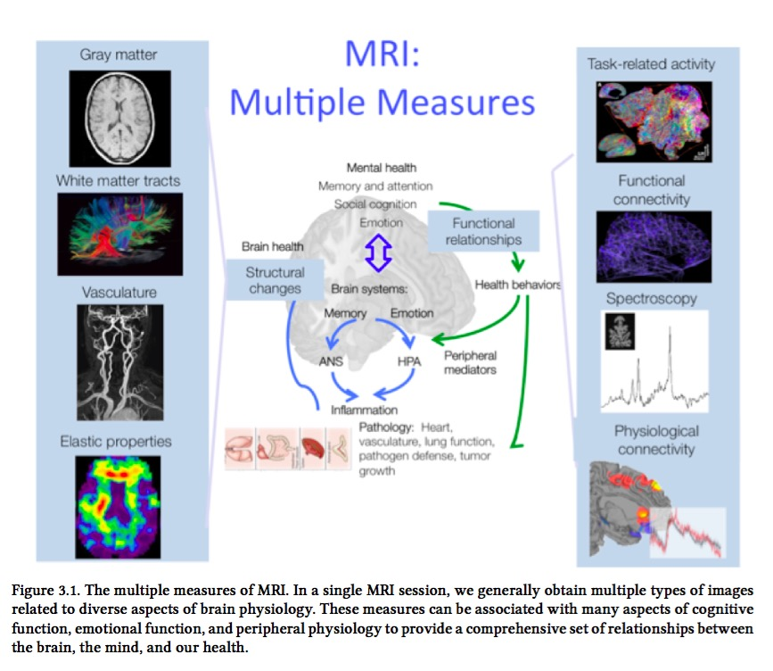
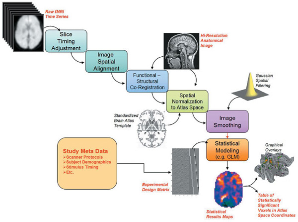

## 2015-01-21 -- Studying human brain function through fMRI

### Questions

1. How does fMRI work? What does it measure?
2. How do "functional" maps of the cerebral cortex derived from fMRI relate to maps derived from other methods?
3. How are fMRI-based maps actually created?

### Readings {.smaller}

**DeYoe, E. A., Bandettini, P., Neitz, J., Miller, D., & Winans, P. (1994). Functional magnetic resonance imaging (FMRI) of the human brain. Journal of Neuroscience Methods, 54(2), 171–187. <http://doi.org/10.1016/0165-0270(94)90191-0>**

Rosen, B. R., Buckner, R. L., & Dale, A. M. (1998). Event-related functional MRI: Past, present, and future. Proceedings of the National Academy of Sciences of the United States of America, 95(3), 773–780. <http://www.pnas.org/content/95/3/773.full#content-block>

## Supplemental

Warnking, J., Dojat, M., Guérin-Dugué, A., Delon-Martin, C., Olympieff, S., Richard, N., … Segebarth, C. (2002). fMRI Retinotopic Mapping—Step by Step. NeuroImage, 17(4), 1665–1683. <http://doi.org/10.1006/nimg.2002.1304>

- [Magnetic Resonance Imaging Explained](https://www.youtube.com/watch?v=MiL0wCZr0Mw)

## Historical background

- Sherrington & Roy: local changes in blood volume in cerebral cortex.
- Kety & Schmidt: regional regulation of blood flow in brain.
- First fMRI paper [[@ogawa_brain_1990]](http://www.pnas.org/content/87/24/9868).
- Early fMRI paper by a competing group: [[@kwong_dynamic_1992]](http://doi.org/10.1073/pnas.89.12.5675)

## Scan components/types

- Structural
    - MP-RAGE (Magnetization Prepared Rapid Acquisition GRE)
        - High resolution (.5-1 mm^3 voxels)
    - Diffusion Tensor Imaging (DTI)
- Functional
    - Blood oxygen level dependent (BOLD) imaging
        - Lower resolution (3 mm^3 voxels)

## Blood Oxygen Level Dependent (BOLD) imaging

- Local changes in blood oxygen
    - Blood volume + O2
- Oxygenated vs. deoxyenaged hemoglobin (Hb)
    - Oxygenated Hb [diamagnetic](https://en.wikipedia.org/wiki/Diamagnetism)
    - De-oxygenated Hb [paramagnetic](https://en.wikipedia.org/wiki/Paramagnetism)
- [Hemodynamic response function (HRF)](https://en.wikipedia.org/wiki/Haemodynamic_response)
    - Initial O2 dip
    - Longer increase to peak, then decline
    
## Why MRI?

    
## Data analysis pathway

[[@horn_sharing_2004]](http:/doi.org/10.1038/nn1231)

## Data analysis pathway

- Convert raw (k-space) maps using inverse FFT
- Adjust "timing" of slices
- Align BOLD images with one another; calculate movement
- Register individual structural image with BOLD image time series
- Normalize individual structural image with template atlas

## Data analysis pathway

- Smooth BOLD images
- Statistical modeling using voxel-wise GLM
    - At individual level
    - At group level
    
## Types of maps [@lindquist_wager_2015]

- Effects of experimental manipulations
- Correlations with behavior, clinical status, or other person-level outcomes
- Correlations with performance or other within-person variables
- Brain areas’ correlation with other specific areas
- Brain areas’ that are part of a group of areas (e.g. a cluster or network)

## Single-subject vs. Group maps

[@lindquist_wager_2015]

## Underlying assumptions

[@lindquist_wager_2015]

## Be careful out there

[@lindquist_wager_2015]

## The future...

- [Neurosynth](http://neurosynth.org/)
- [OpenfMRI.org](https://openfmri.org)
- [Brain Imaging Data Structure](http://bids.neuroimaging.io)
- [Reproducible neuroscience](http://reproducibility.stanford.edu)
- [Human Connectome Project](http://www.humanconnectomeproject.org)
- [[@poldrack_long-term_2015]](http://doi.org/10.1038/ncomms9885)

## References {.smaller}
